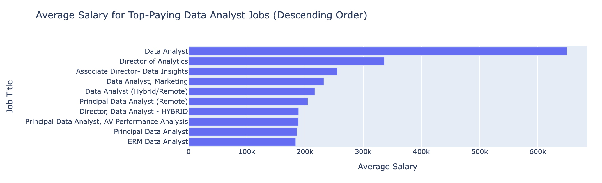
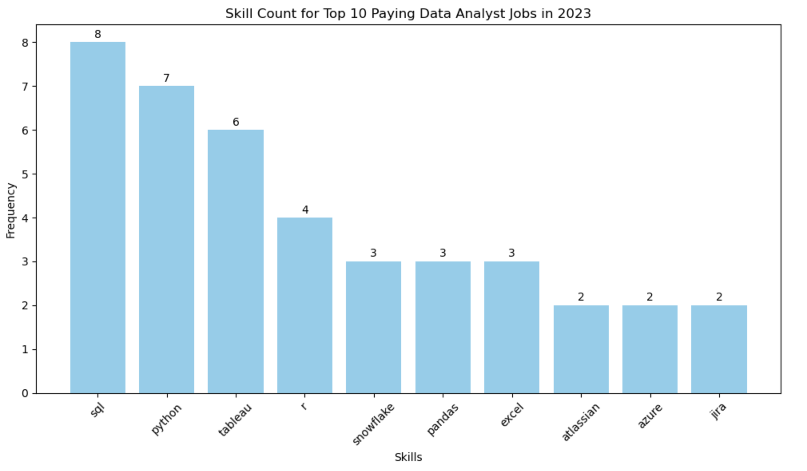

# Introduction
It is a pet project that focuses on exploring the realm of data analyst roles. This project delves into identifying top-paying jobs, in-demand skills, and the intersection where high demand meets high salary in the field of data analytics.

You can find the SQL queries here: [project folder](/pet_project_sql/)

The data is taken from the [SQL Course](https://lukebarousse.com/sql). It contains valuable information regarding job titles, salaries, locations, and necessary skills.

### The questions I wanted to answer through SQL queries were:

1. What are the top-paying data analyst jobs?
2. What skills are required for these top-paying jobs?
3. What skills are most in demand for data analysts?
4. Which skills are associated with higher salaries?
5. What are the most optimal skills to learn?

# Tools I Used
In my comprehensive exploration of the data analyst job market, I leveraged a suite of essential tools:

- **SQL:** Serving as the foundation of my analysis, SQL empowered me to extract valuable insights by querying the database effectively.
- **PostgreSQL:** PostgreSQL proved instrumental in managing and organizing the extensive job posting data.
- **Visual Studio Code:** I relied on Visual Studio Code for database management tasks and executing SQL queries, providing a seamless environment for coding and analysis.
- **Git & GitHub:** These tools were indispensable for version control, enabling me to track changes, collaborate with others, and share my SQL scripts and analysis efficiently.

# The Analysis
For this project, each query aimed to investigate specific aspects of the data analyst job market. Here is how I approached each question:

### 1. Top 10 Paying Data Analyst Jobs
To identify high-paying remote data analyst positions, I filtered by location and annual salary, highlighting top opportunities.

```sql
SELECT
    job_id,
    job_title,
    cd.name AS company,
    job_location,
    job_schedule_type,
    salary_year_avg,
    job_no_degree_mention
FROM
    job_postings_fact AS jpf
    LEFT JOIN company_dim AS cd
        ON jpf.company_id = cd.company_id  
WHERE
    job_title_short = 'Data Analyst'
    AND job_location = 'Anywhere'
    AND salary_year_avg IS NOT NULL
    AND job_no_degree_mention = TRUE
ORDER BY
    salary_year_avg DESC
LIMIT
    10;
```
The following is a breakdown of the top data analyst jobs in 2023:
- **Wide Salary Range:** The top 10 paying data analyst roles range from $184,000 to $650,000, indicating a significant earning potential in the field.
- **Diverse Employers:** Companies such as Mantys, Meta, and AT&T are among those offering high salaries, providing a diverse range of opportunities for data analysts.
- **Job Title Variety:** There is a high variety in job titles, ranging from Data Analyst to Director of Analytics, reflecting the diverse roles and specializations within the field of data analytics.



### 2. Skills for Top 10 Paying Jobs
To gain insight into skills required for high-paying jobs, I analyzed job postings and skills data to determine what employers value.
```sql
WITH top_paying_jobs AS (
    SELECT
        job_id,
        job_title,
        cd.name AS company,
        salary_year_avg
    FROM
        job_postings_fact AS jpf
        LEFT JOIN company_dim AS cd
            ON jpf.company_id = cd.company_id  
    WHERE
        job_title_short = 'Data Analyst'
        AND job_location = 'Anywhere'
        AND salary_year_avg IS NOT NULL
    ORDER BY
        salary_year_avg DESC
    LIMIT
        10
)

SELECT
    sd.skills,
    COUNT(sd.skills)
FROM
    skills_job_dim AS sjd
    JOIN skills_dim AS sd
        ON sjd.skill_id = sd.skill_id
    RIGHT JOIN top_paying_jobs AS tpj
        ON tpj.job_id = sjd.job_id
GROUP BY
    sd.skills
ORDER BY
    COUNT(sd.skills) DESC
LIMIT 10;
```
Here's the breakdown of the most demanded skills for the top 10 highest paying data analyst jobs in 2023:
- **SQL** is currently the most in-demand skill with a total of 8.
- **Python** is a close second with 7.
- **Tableau** is also highly sought after with 6.
- Other skills such as **R**, **Snowflake**, **Pandas**, and **Excel** show varying levels of demand.




### 3. In-Demand Skills for Data Analysts

This query helped identify the most in-demand skills by analyzing job postings.

```sql
SELECT
    sd.skills,
    COUNT(sjd.job_id) AS demand_count
FROM
    job_postings_fact AS jpf
    INNER JOIN skills_job_dim AS sjd
        ON jpf.job_id = sjd.job_id
    INNER JOIN skills_dim AS sd
        ON sjd.skill_id = sd.skill_id
WHERE 
    jpf.job_title_short = 'Data Analyst'
    AND jpf.job_location = 'Anywhere'
GROUP BY
    sd.skills
ORDER BY
    demand_count DESC
LIMIT 5;
```
The most in-demand skills for data analysts in 2023.
- **SQL** and **Excel** rare still considered fundamental, highlighting the importance of having strong foundational skills in data processing and spreadsheet manipulation.
- On the other hand, **Programming** and **Visualization Tools** like **Python**, **Tableau**, and **Power BI** have become essential, indicating the growing significance of technical skills in data storytelling and decision support. 

| Skills   | Demand Count |
|----------|--------------|
| SQL      | 7291         |
| Excel    | 4611         |
| Python   | 4330         |
| Tableau  | 3745         |
| Power BI | 2609         |

### 4. Skills Based on Salary
Exploring the average salaries associated with different skills revealed which skills are the highest paying.
```sql
SELECT
    sd.skills,
    ROUND(AVG(jpf.salary_year_avg),0) AS avg_salary
FROM
    job_postings_fact AS jpf
    INNER JOIN skills_job_dim AS sjd
        ON jpf.job_id = sjd.job_id
    INNER JOIN skills_dim AS sd
        ON sjd.skill_id = sd.skill_id
WHERE 
    jpf.job_title_short = 'Data Analyst'
    AND jpf.salary_year_avg IS NOT NULL
    AND jpf.job_location = 'Anywhere'
GROUP BY
    sd.skills
ORDER BY
    avg_salary DESC
LIMIT 10;
```
Here's a breakdown of the results for top paying skills for Data Analysts:
- **Big Data & Machine Learning Proficiency:**  Analysts skilled in big data technologies like PySpark and Couchbase, along with machine learning tools such as DataRobot and Jupyter, command high salaries. Mastery of Python libraries like Pandas and NumPy further enhances earning potential, reflecting the industry's emphasis on data processing and predictive modeling capabilities.
- **Software Development & Deployment Competence:** Knowledge of development and deployment tools like GitLab, Kubernetes, and Airflow signifies a lucrative fusion of data analysis and engineering. Proficiency in these tools facilitates automation and efficient data pipeline management, contributing to elevated earning prospects.
- **Cloud Computing Acumen:** Expertise in cloud and data engineering tools like Elasticsearch, Databricks, and GCP is highly valued in the data analytics landscape. This underscores the increasing significance of cloud-based analytics environments, suggesting that proficiency in cloud computing significantly amplifies earning potential in data analytics roles.

| Skills        | Average Salary ($) |
|---------------|-------------------:|
| pyspark       |            208,172 |
| bitbucket     |            189,155 |
| couchbase     |            160,515 |
| watson        |            160,515 |
| datarobot     |            155,486 |
| gitlab        |            154,500 |
| swift         |            153,750 |
| jupyter       |            152,777 |
| pandas        |            151,821 |
| elasticsearch |            145,000 |

### 5. Most Optimal Skills to Learn

This query sought to identify skills that are not only in high demand but also command high salaries, providing strategic guidance for skill development.

```sql
WITH skills_demand AS (
    SELECT
        sd.skill_id,
        sd.skills,
        COUNT(sjd.job_id) AS demand_count
    FROM
        job_postings_fact AS jpf
        INNER JOIN skills_job_dim AS sjd
            ON jpf.job_id = sjd.job_id
        INNER JOIN skills_dim AS sd
            ON sjd.skill_id = sd.skill_id
    WHERE 
        jpf.job_title_short = 'Data Analyst'
        AND jpf.salary_year_avg IS NOT NULL
        AND jpf.job_location = 'Anywhere'
    GROUP BY
        sd.skill_id
),

avg_salary AS (
    SELECT
        sd.skill_id,
        sd.skills,
        ROUND(AVG(jpf.salary_year_avg),0) AS avg_salary
    FROM
        job_postings_fact AS jpf
        INNER JOIN skills_job_dim AS sjd
            ON jpf.job_id = sjd.job_id
        INNER JOIN skills_dim AS sd
            ON sjd.skill_id = sd.skill_id
    WHERE 
        jpf.job_title_short = 'Data Analyst'
        AND jpf.salary_year_avg IS NOT NULL
        AND jpf.job_location = 'Anywhere'
    GROUP BY
        sd.skill_id
)

SELECT
    skills_demand.skills,
    demand_count,
    avg_salary
FROM skills_demand
    INNER JOIN avg_salary
        ON skills_demand.skill_id = avg_salary.skill_id
WHERE
    demand_count > 10
ORDER BY
    avg_salary DESC,
    demand_count DESC
LIMIT 50;
```

| Skills     | Demand Count | Average Salary ($) |
|------------|--------------|-------------------:|
| go         | 27           |            115,320 |
| confluence | 11           |            114,210 |
| hadoop     | 22           |            113,193 |
| snowflake  | 37           |            112,948 |
| azure      | 34           |            111,225 |
| bigquery   | 13           |            109,654 |
| aws        | 32           |            108,317 |
| java       | 17           |            106,906 |
| ssis       | 12           |            106,683 |
| jira       | 20           |            104,918 |


Here's an analysis of the most advantageous skills for Data Analysts in 2023:
- **High-Demand Programming Languages:** **Python** and **R** are highly sought-after, with demand counts of 236 and 148, respectively. Despite their popularity, the average salaries for **Python** and **R** are approximately $101,397 and $100,499, respectively. This suggests that while proficiency in these languages is valued, competition may lead to more standardized salary levels.
- **Cloud Tools and Technologies:** Specialized technologies like **Snowflake**, **Azure**, **AWS**, and **BigQuery** exhibit significant demand alongside relatively high average salaries. This trend underscores the increasing significance of cloud platforms and big data technologies in the field of data analysis.
- **Business Intelligence and Visualization Tools:** **Tableau** and **Looker**, with demand counts of 230 and 49, respectively, offer average salaries around $99,288 and $103,795. These figures underscore the pivotal role of data visualization and business intelligence tools in extracting actionable insights from datasets.
- **Database Technologies:** Skills in traditional and NoSQL databases (such as **Oracle**, **SQL Server**, and **NoSQL**) remain in demand, with average salaries ranging from $97,786 to $104,534. This reflects the ongoing need for expertise in data storage, retrieval, and management.

# What I Learned

Here's what I've learned throughout this journey:
- **Crafting Complex Queries:** I've delved deep into SQL, mastering advanced techniques to merge tables seamlessly and wield WITH clauses for efficient temporary table operations.
- **Aggregating Data:** I became comfortable with GROUP BY and transformed aggregate functions like COUNT() and AVG() into my go-to tools for summarizing data effectively.
- **Analytical Problem-Solving:** I've sharpened my skills in transforming complex questions into actionable insights, gaining practical experience in addressing real-world data challenges through SQL queries.

Additionally, I've gained hands-on experience with essential development tools:

- **Git for Version Control:** I've acquired hands-on experience with Git, enabling smoother collaboration and improved project versioning.
- **VSCode:**  I've refined my abilities in utilizing VSCode for managing databases and running SQL queries.

# Conclusions

### Insights
- **Top-Paying Data Analyst Jobs:** Remote data analyst roles offer diverse salary ranges, with the highest recorded at $650,000, showcasing significant earning potential in this field.
- **Skills for Top-Paying Jobs:** Proficiency in SQL emerges as crucial for securing high-paying data analyst positions, underscoring its importance in maximizing earning potential.
- **Most In-Demand Skills:** SQL remains the most sought-after skill in the data analyst job market, highlighting its indispensability for job seekers aiming to meet market demands.
- **Skills with Higher Salaries:** Specialized proficiencies like SVN and Solidity command top-tier average salaries, emphasizing the value placed on niche expertise in the field.
- **Optimal Skills for Job Market Value:** Given its high demand and lucrative salary offerings, SQL stands out as one of the most strategic skills for data analysts seeking to enhance their market value.

### Closing Thoughts

This project has been extremely helpful in improving my SQL skills and providing valuable insights into the dynamic and ever-changing data analyst job market. The analysis results act as a guide for prioritizing skill enhancement and job search strategies. Aspiring data analysts can optimize their position in a competitive job market by developing skills that are in high demand and offer good salaries. This project emphasizes the importance of continuous learning and adaptability to evolving trends in the field of data analytics.
